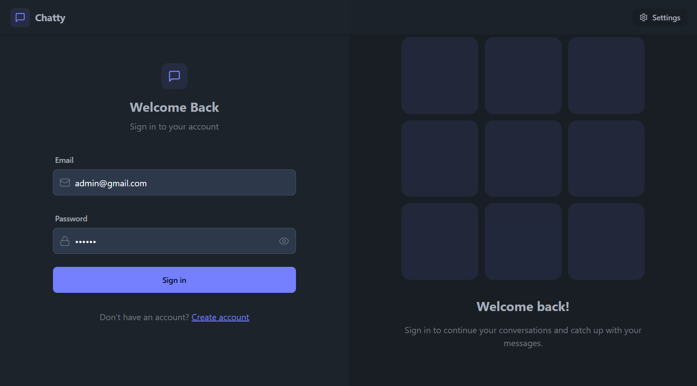
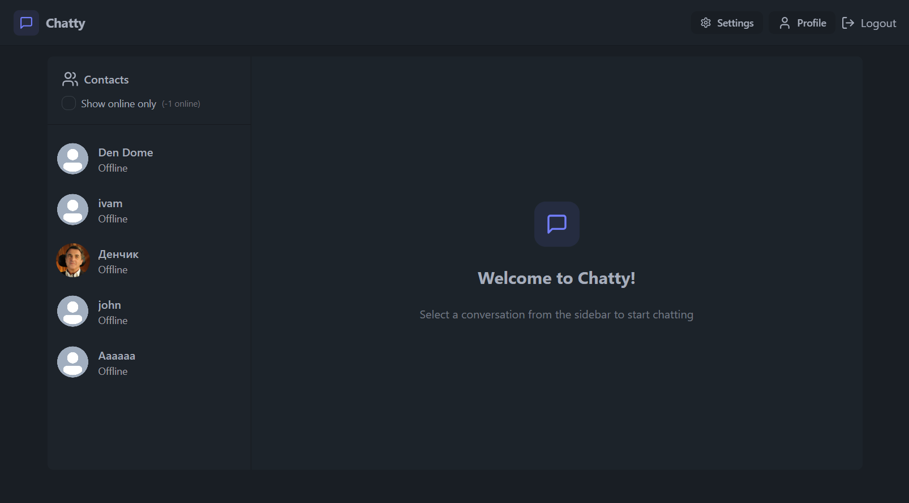
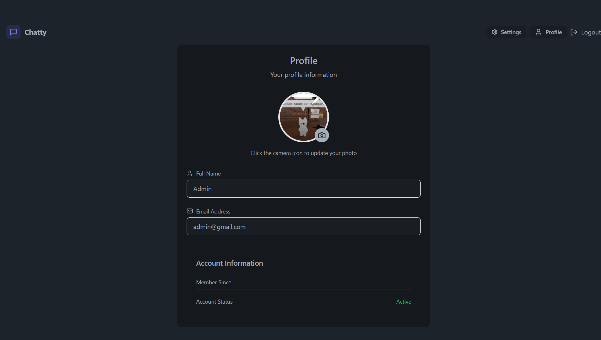
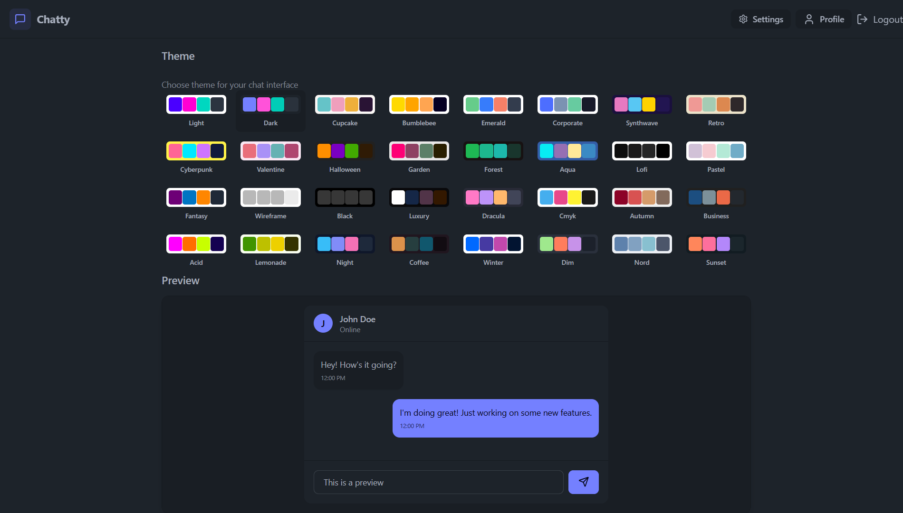

# 💬 RTChatApp — Real-Time Chat Application

[🇬🇧 English](#eng) | [🇷🇺 Русский](#ru)

# Eng

A full-stack real-time chat application built with the **MERN stack** and **Socket.io**. Users can register, log in, and exchange messages instantly with WebSocket-based communication. Deployed and live.

🔗 **[Live Demo](https://chatlili.onrender.com/)**

---

## 📸 Screenshots

### Login Page

### Home Page

### Profile Page

### Settings Page


---

## ✨ Features

- **Real-time messaging** — instant message delivery via WebSockets (Socket.io)
- **User authentication** — secure registration and login with JWT
- **Persistent chat history** — messages stored in MongoDB and loaded on reconnect
- **Online user status** — see who is currently online
- **Responsive UI** — works on both desktop and mobile

---

## 🏗️ Project Structure

```
RTChatApp_MERN/
├── backend/       # Node.js + Express REST API + Socket.io server
├── frontend/      # React client
└── package.json   # Root scripts for build and start
```

---

## ⚙️ Tech Stack

### Backend
- **Node.js** + **Express.js** — REST API and HTTP server
- **Socket.io** — WebSocket-based real-time communication
- **MongoDB** + **Mongoose** — message and user data storage
- **JWT** — stateless authentication
- **bcrypt** — password hashing

### Frontend
- **React** — UI library
- **Socket.io-client** — real-time connection to the server
- **JavaScript (ES6+)**
- **CSS** — styling

---

## 🚀 Running Locally

### Prerequisites
- Node.js installed
- MongoDB running locally or a MongoDB Atlas URI

### Steps

1. Clone the repository:
```bash
git clone https://github.com/DenDOme/RTChatApp_MERN.git
cd RTChatApp_MERN
```

2. Set up the backend:
```bash
cd backend
cp .env.example .env    # fill in your values
npm install
npm run start
```

3. Set up the frontend (in a new terminal):
```bash
cd frontend
npm install
npm run dev
```

Or build and run everything from root:
```bash
npm run build
npm run start
```

---

## 🔑 Environment Variables

Create a `.env` file in the `backend/` folder:

```env
PORT=5000
MONGO_URI=mongodb://localhost:27017/rtchat
JWT_SECRET=your_jwt_secret
JWT_EXPIRES_IN=7d
NODE_ENV=development
```

---

## 📡 API Endpoints

| Method | Route | Description | Auth Required |
|---|---|---|---|
| `POST` | `/api/auth/register` | Register a new user | No |
| `POST` | `/api/auth/login` | Log in and receive JWT | No |
| `POST` | `/api/auth/logout` | Log out | Yes |
| `GET` | `/api/messages/:conversationId` | Get chat history | Yes |
| `GET` | `/api/users` | Get all users | Yes |

---

## 🔌 Socket.io Events

| Event | Direction | Description |
|---|---|---|
| `sendMessage` | Client → Server | User sends a message |
| `receiveMessage` | Server → Client | Deliver message to recipient |
| `getOnlineUsers` | Server → Client | Broadcast list of online users |

---

## 📬 Contact

**Kerim Shen**
- GitHub: [@DenDOme](https://github.com/DenDOme)
- LinkedIn: [kerim-web](https://linkedin.com/in/kerim-web)
- Email: newlifeofkirim@gmail.com

# Ru

Полнофункциональное приложение для общения в реальном времени, построенное на **стеке MERN** и **Socket.io**. Пользователи могут регистрироваться, входить в систему и мгновенно обмениваться сообщениями через WebSocket-соединение. Задеплоено и доступно в сети.

🔗 **[Демо](https://chatlili.onrender.com/)**

---

## 📸 Скриншоты

### Страница Авторизации

### Домашняя Страница

### Страница Профиль

### Страница Настроек


---

## ✨ Возможности

- **Обмен сообщениями в реальном времени** — мгновенная доставка сообщений через WebSocket (Socket.io)
- **Аутентификация пользователей** — безопасная регистрация и вход с использованием JWT
- **Хранение истории чата** — сообщения сохраняются в MongoDB и загружаются при повторном подключении
- **Статус онлайн** — отображение активных пользователей
- **Адаптивный интерфейс** — работает как на десктопе, так и на мобильных устройствах

---

## 🏗️ Структура проекта

```
RTChatApp_MERN/
├── backend/       # REST API на Node.js + Express + сервер Socket.io
├── frontend/      # React-клиент
└── package.json   # Корневые скрипты для сборки и запуска
```

---

## ⚙️ Технологический стек

### Бэкенд
- **Node.js** + **Express.js** — REST API и HTTP-сервер
- **Socket.io** — WebSocket-коммуникация в реальном времени
- **MongoDB** + **Mongoose** — хранение сообщений и данных пользователей
- **JWT** — аутентификация без сохранения состояния
- **bcrypt** — хеширование паролей

### Фронтенд
- **React** — библиотека для построения интерфейса
- **Socket.io-client** — подключение к серверу в реальном времени
- **JavaScript (ES6+)**
- **CSS** — стилизация

---

## 🚀 Локальный запуск

### Требования
- Установленный Node.js
- Локальная MongoDB или URI для MongoDB Atlas

### Шаги

1. Клонируйте репозиторий:
```bash
git clone https://github.com/DenDOme/RTChatApp_MERN.git
cd RTChatApp_MERN
```

2. Настройте бэкенд:
```bash
cd backend
cp .env.example .env    # заполните значения
npm install
npm run start
```

3. Настройте фронтенд (в новом терминале):
```bash
cd frontend
npm install
npm run dev
```

Или соберите и запустите всё из корня:
```bash
npm run build
npm run start
```

---

## 🔑 Переменные окружения

Создайте файл `.env` в папке `backend/`:

```env
PORT=5000
MONGO_URI=mongodb://localhost:27017/rtchat
JWT_SECRET=ваш_jwt_секрет
JWT_EXPIRES_IN=7d
NODE_ENV=development
```

---

## 📡 API-эндпоинты

| Метод | Маршрут | Описание | Требует авторизации |
|---|---|---|---|
| `POST` | `/api/auth/register` | Регистрация нового пользователя | Нет |
| `POST` | `/api/auth/login` | Вход и получение JWT | Нет |
| `POST` | `/api/auth/logout` | Выход из системы | Да |
| `GET` | `/api/messages/:conversationId` | Получить историю чата | Да |
| `GET` | `/api/users` | Получить всех пользователей | Да |

---

## 🔌 События Socket.io

| Событие | Направление | Описание |
|---|---|---|
| `sendMessage` | Клиент → Сервер | Отправка сообщения пользователем |
| `receiveMessage` | Сервер → Клиент | Доставка сообщения получателю |
| `getOnlineUsers` | Сервер → Клиент | Рассылка списка активных пользователей |

---

## 📬 Контакты

**Керим Шен**
- GitHub: [@DenDOme](https://github.com/DenDOme)
- LinkedIn: [kerim-web](https://linkedin.com/in/kerim-web)
- Email: newlifeofkirim@gmail.com